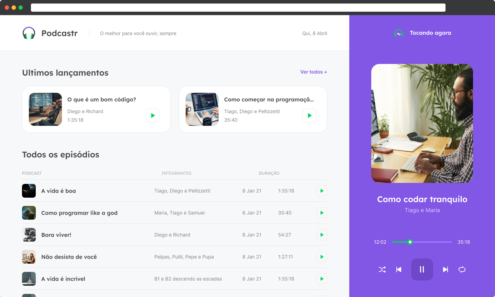

<p align="center">
    
    <a href="https://github.com/matheusazambuja/podcastr/commits/main">
        
    </a>
    
    <a href="https://github.com/matheusazambuja/podcastr/stargazers">
        
    </a>
</p>

<div align="center">
  
</div>

<h4 align='center'>
  Podcastr is a platform built for podcast broadcasting
</h4>



<!-- .... -->

## Technologies
The following tools were used to build this project:

- [ReactJS](https://reactjs.org/)
- [Typescript](https://www.typescriptlang.org/)
- [Next.js](https://nextjs.org/)
- [ChakraUI](https://chakra-ui.com/)

## 💻 Getting started

### Requirements

- Before we get started, you need to check if you have on your PC the following tools: 
- You need to install both [Node.js](https://nodejs.org/en/download/) and ([Yarn](https://yarnpkg.com/) or [npm](https://www.npmjs.com/)) to run this project.
- Beside that we recommend you have a good editor to work with the [VSCode](https://code.visualstudio.com/)

**Clone the project and access the folder**

```bash
$ git clone https://github.com/matheusazambuja/podcastr.git && cd podcastr
```

## Starting
**Follow the steps below**

To start the application, use the following command:

```bash
# - If you have installed Yarn
# Install the dependencies
$ yarn
# Run the backend fake server
$ yarn server
# Run the web server
$ yarn dev
```

```bash
# - If you have installed npm
# Install the dependencies
$ npm install
# Run the backend fake server
$ npm run server
# Run the web server
$ npm run dev
```


The app will be available for access on your browser at `http://localhost:3000`

---

## Support

Reach out to me at one of the following places!

- Linkedin at [Matheus Azambuja](https://www.linkedin.com/in/matheus-azambuja-9197411a1/)
- Instagram [MatheusAzambuja](https://www.instagram.com/salve_mth5/)

---
## 📝 License

This project is licensed under the MIT License - see the [LICENSE](LICENSE) file for details.

---

Made with 💜 by Matheus Azambuja 👋 [Check out my LinkedIn](https://www.linkedin.com/in/matheus-azambuja-9197411a1/)